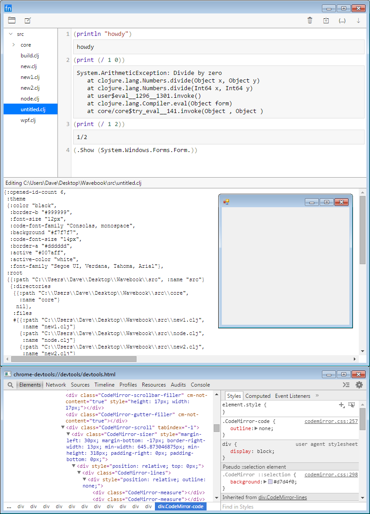

## What is this?
A [ClojureCLR](https://github.com/clojure/clojure-clr) REPL integrated code editor.

- Edit and evaluate code without restarting the process.
- See standard output and error on the next line of the code editor.
- Run either standalone (exe) or embedded in a program (dll).
- Compatible with CLR (C#, F#, ClojureCLR, etc.) programs.

## Screenshot
This screenshot shows FnEdit in development mode.  The development version displays Chromium's dev tools and a pretty printed view of the current program state.



## How does it run?
These build instructions are for building a standalone executable development version.

1.  Install these programs and make sure they are on the path:
    - [boot](http://boot-clj.com/)
    - [nuget](https://www.nuget.org/)
    - [ildasm](https://msdn.microsoft.com/en-us/library/f7dy01k1(v=vs.110).aspx)
1.  Install dependenices, with each returning "Successfully installed."
    ```
    C:\New\fnedit>boot clr-deps
    Downloading https://github.com/boot-clj/boot/releases/download/2.4.2/boot.jar...done.
    Nuget is resolving package Clojure version 1.6.0.1
    {:exit 0,
     :out
     "Installing 'Clojure 1.6.0.1'.\r\nSuccessfully installed 'Clojure 1.6.0.1'.\r\n",
     :err ""}

    Nuget is resolving package cef.redist.x64 version 3.2171.2069
    {:exit 0,
     :out
     "Installing 'cef.redist.x64 3.2171.2069'.\r\nSuccessfully installed 'cef.redist.x64 3.2171.2069'.\r\n",
     :err ""}

    Nuget is resolving package CefSharp.Common version 39.0.2
    {:exit 0,
     :out
     "Attempting to resolve dependency 'cef.redist.x86 (= 3.2171.2069)'.\r\nAttempting to resolve dependency 'cef.redist.x64 (= 3.2171.2069)'.\r\nInstalling 'cef.redist.x86 3.2171.2069'.\r\nSuccessfully installed 'cef.redist.x86 3.2171.2069'.\r\nInstalling 'CefSharp.Common 39.0.2'.\r\nSuccessfully installed 'CefSharp.Common 39.0.2'.\r\n",
     :err ""}

    Nuget is resolving package CefSharp.WinForms version 39.0.2
    {:exit 0,
     :out
     "Attempting to resolve dependency 'CefSharp.Common (= 39.0.2)'.\r\nAttempting to resolve dependency 'cef.redist.x86 (= 3.2171.2069)'.\r\nAttempting to resolve dependency 'cef.redist.x64 (= 3.2171.2069)'.\r\nInstalling 'CefSharp.WinForms 39.0.2'.\r\nSuccessfully installed 'CefSharp.WinForms 39.0.2'.\r\n",
     :err ""}
    ```
1.  In one terminal run the Clojurescript compiler:
    ```
    C:\New\fnedit>boot cljs -wd

    Starting file watcher (CTRL-C to quit)...

    Sifting output files...
    Adding jar entries from codemirror-5.1.0-0.jar...
    Sifting output files...
    Writing main.cljs.edn...
    Compiling ClojureScript...
    ò main.js
    Elapsed time: 19.500 sec
    ```
1.  In a second terminal run the Clojure CLR compiler:
    ```
    C:\New\fnedit>boot clr -wsdf
    Sifting output files...
    Sifting output files...
    Sifting output files...
    Sifting output files...

    Starting file watcher (CTRL-C to quit)...

    Compiling core.main
    {:exit 0,
     :out
     "Compiling core.main to C:\\Users\\Dave\\.boot\\cache\\tmp\\New\\fnedit\\12u8\\-x2a4id -- 2226 milliseconds.\r\n",

     :err ""}

    Sifting output files...
    ```

## What are some interesting parts of the code?
- Reloadable AOT compilation for the CLR.  This is particularly helpful when generating a class is necessary for using a CLR library.  When ClojureCLR compiles with gen-class it loads those classes into the main AppDomain.  This causes the dll files created to be locked so the next time compilation is attempted there will be an error since it cannot overwrite the locked files.  The aot-compile function compiles the code in a separate AppDomain and then unloads it when finished, preventing the locking and need for a process restart between every code change: [aot_compiler.clj](src-clr/core/aot_compiler.clj).
- [Reagent](https://github.com/reagent-project/reagent) components:
  - Tree view: [tree_view.cljs](src-cljs/ui/tree_view.cljs)
  - Horizontal splitter: [hsplitter.cljs](src-cljs/ui/hsplitter.cljs)
  - Wrapper around Codemirror: [editor.cljs](src-cljs/ui/editor.cljs)
- User interface state is stored in a single atom.  Events are sent over a single core.async channel, look at the main function: [core.cljs](src-cljs/ui/core.cljs).  All swap! calls on the state atom occur after the process-commands function in [coordianation.cljs](src-cljs/ui/coordianation.cljs).
- ClojureCLR on its own cannot create a Windows GUI exe.  Normally this would be done by creating a C# project which then calls ClojureCLR.  To avoid this hassel the subsystem can be modified with the ildasm program like the to-gui-subsystem task does in build.boot.  Also necessary is how the main function creates a special thread: [main.clj](src-clr/core/main.clj).  It would be nice if ClojureCLR had a gen-class argument which specified the subsystem.

## What similar projects are there?
- [Gorilla REPL](http://gorilla-repl.org/)
- [Session](https://medium.com/@kovasb/session-1a12997a5f70#.h3d4x3us5)
- [LightTable](http://lighttable.com/)
- [IPython](https://ipython.org/)

## What are some of its limitations?
The code editor is not the most efficient in the world.  If a file is opened with 20k lines it will be noticeably slow especially when there are a lot of printed results.  It is also fairly large in size in terms of disk space and memory usage due to using Chromium for its user interface.  The editor is very basic, for example no search and replace.

## What should have been done differently?
This work should have been directed towards the CLR port of nrepl or ClojureCLR 1.8.  That way the REPL could use any number of excellent IDEs.  Perhaps the integrated editor would help novice coders get up to speed more easily, but overall that effort would have been better spent on other things.

## What is the status of the project?
This project is in working order, but it is not recommended for use unless significant effort is devoted to improving it and keeping dependencies up to date.  This project should be considered an experiment.

## Why was this made?
At the time this project was started I was working at a company which made among other things a plugin for a third party scientific program.  The third party program was particularly slow to startup for a number of reasons and developers would be stuck with ten minutes of downtime between writing some new code and being able to test it against some relevant project data.  This was incredibly frustrating, especially considering we had fast machines and some of the third party APIs had incomplete documentation therefore leaving some work to guess and check.  I had no control over the third party program to make it more efficient.  A REPL would permit me to write and evaluate code in a perpetual loop without restarting the process, saving countless hours and headaches.  Additionally an integrated editor interface would allow some scientists we knew to write scripts that they were already interested in writing.  These scientists were spending more time learning about how to create plugins and install them the traditional way than doing what they were good at.  I thought a REPL and lightweight editor would cut down on that hassel and empower the scientists to do their best work.

## What is the license?

Copyright 2016 David O'Meara

Licensed under the Apache License, Version 2.0 (the "License");
you may not use this file except in compliance with the License.
You may obtain a copy of the License at

http://www.apache.org/licenses/LICENSE-2.0

Unless required by applicable law or agreed to in writing, software
distributed under the License is distributed on an "AS IS" BASIS,
WITHOUT WARRANTIES OR CONDITIONS OF ANY KIND, either express or implied.
See the License for the specific language governing permissions and
limitations under the License.
